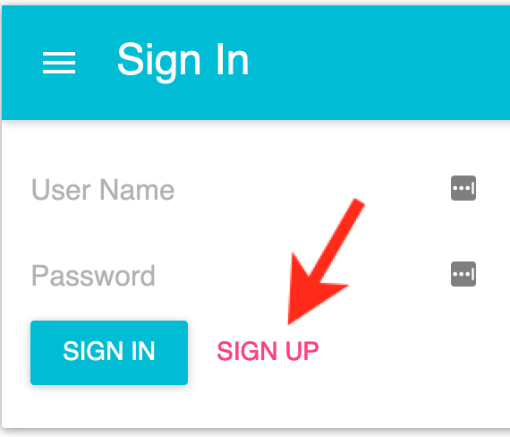
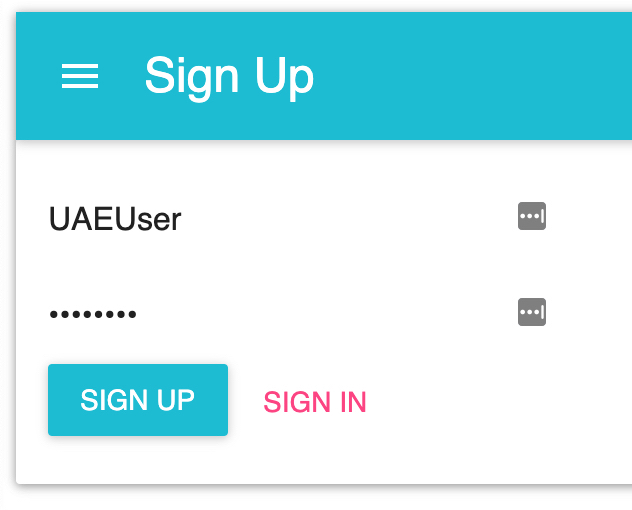
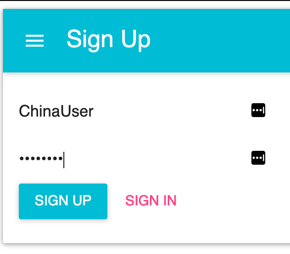
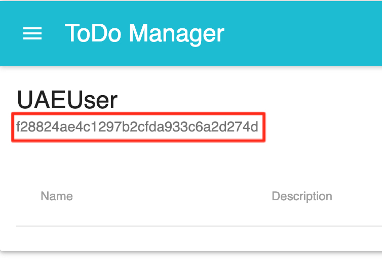
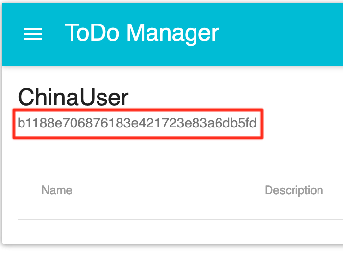
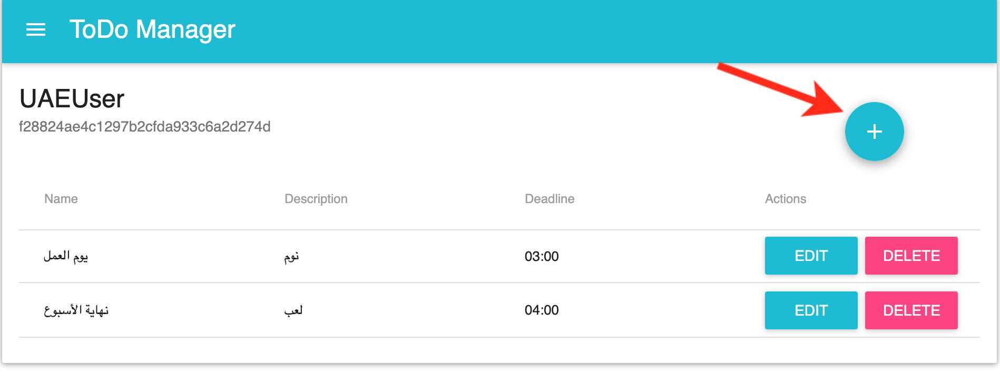
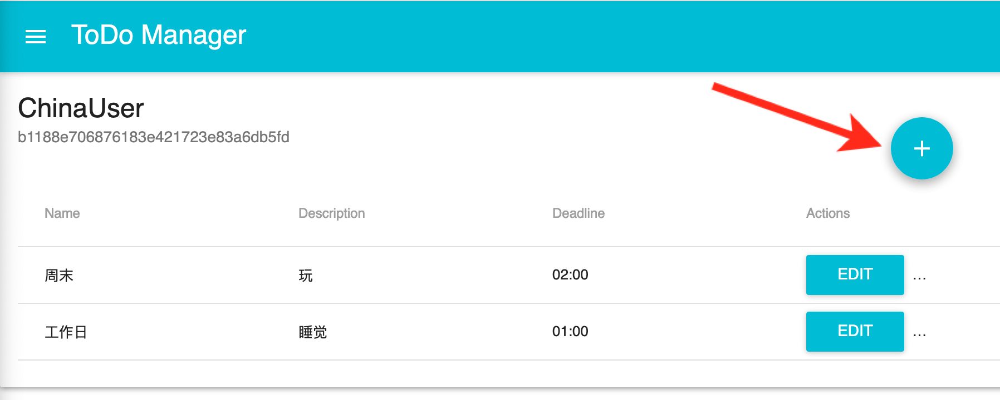
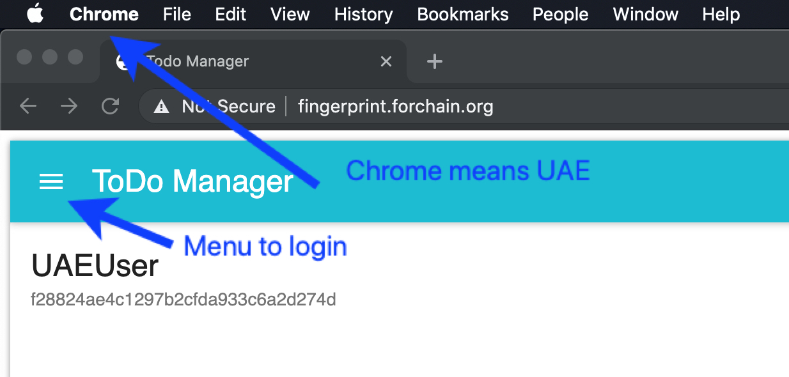
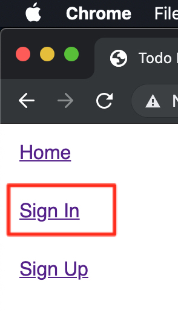
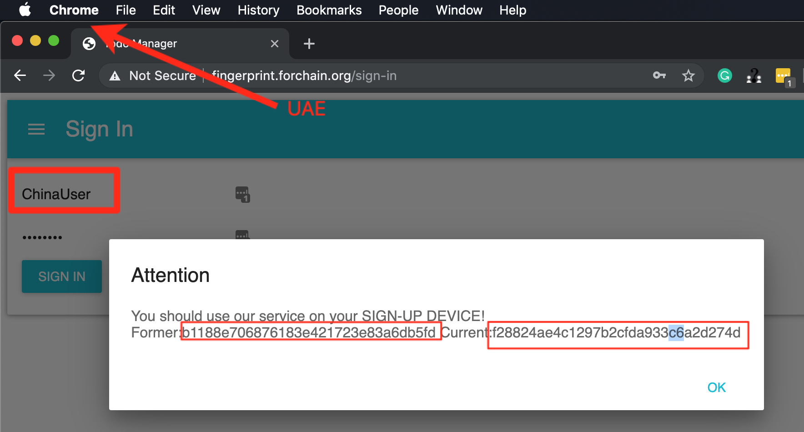

# User-Print: One Machine One License 

## Abstract
User-fingerprint is a live proof-of-concept project to demostrate how to make use of boweser fingerprint in order to identify a user and limit his accessibility only in one machine, so that he won't be able to share his one-user license to an unscribed user.

## Motivation
Our data is valuable and we may live with if it gets enough protection so we have full control of it. However, in an digital world, the cost of making a copy of data is negligible. So, we need to protect our data from being misued by a wrong hand. Device fingerprint is a solution to identifiy a user by colleting necessary information from client remoting computing devices. Browser fingerprint is a branch of device fingerprint and is getting more and more prevailing since browser could be cross-platform and can be assible by any devivces. However, browser fingerprint is also facing much more chanllenges than other device fingerprint approaches because of no native accessiblility.

## Terminology
The technical specification should describe the syntax and semantics of any new feature. 
### Device Fingerprint[[1]](https://en.wikipedia.org/wiki/Device_fingerprint)
A device fingerprint, machine fingerprint, or browser fingerprint is information collected about a remote computing device for the purpose of identification. Fingerprints can be used to fully or partially identify individual users or devices even when persistent cookies (and also zombie cookies) can't be read or stored in the browser, the client IP address is hidden, and even if one switches to another browser on the same device. This may allow a remote application to detect and prevent online identity theft and credit card fraud, but also to compile long-term records of individuals' browsing histories even when they're attempting to avoid tracking, raising a major concern for internet privacy advocates.

### Browser Fingerprint[[2]](https://pixelprivacy.com/resources/browser-fingerprinting/)
Browser fingerprinting is a powerful method that websites use to collect information about your browser type and version, as well as your operating system, active plugins, timezone, language, screen resolution and various other active settings.Websites use the information provided by browsers to identify unique users and track their online behavior.

### Characteristic[[5]](https://www.thesecuritybuddy.com/data-breaches-prevention/what-is-device-fingerprinting/2/)
1. Uniqueness

    The device should be well differentiated from other devices based on the factors on which fingerprinting is done. In other words, the fingerprint should contain enough entropy.

2. Persistence

    The fingerprint should be able to be used for a considerably long amount of time. For example, fingerprints based on Operating Systems data is more persistent than that on browser data.

3. Resistance

    The fingerprints should be resistant, i.e. it should not be able to be tampered easily by the fraudsters. For example, fingerprints based on cookies are not much resistant, as it can easily be deleted or copied.

4. Integration

    Device Fingerprinting technology used should be easily integrated with the business requirements. For example, it is good if a set of web-APIs enable integration of Device Fingerprinting into the existing business.

5. Zero Impact 

    Device Fingerprinting solution should have no significant impact on customer experience and IT infrastructure. Customers should not need to install some additional software or use some hardware token.

6. No Delay

    There should be no significant delay in the Device Fingerprinting solution. It should be able to calculate device risk in real time.

7. First-time Fraud Detection

    Device Fingerprinting solution should be able to effectively protect against first-time fraud attempts. It can be done by looking at a number of factors like whether the device is hiding its IP, location or Geo, whether the device is compromised by malware or part of a botnet etc.

## Performance analysis
Browser has many advatanges, like cross platform, no native installtion requirement, also,  there are some disadvantages, for example, the biggest problems lies in that it has little accuracy than native device fingerprint. To be more formal, we use the characterstics to evaluate its performance
1.  Uniqueness

Browser API is really hard to read a uniqeness number since some device identifier like MAC ID needs native permission. So, the current solution is using multiple parameters combined to reduce the probability that two machines with their fingerprint collide.

2. Persistence
Browser API is so sensitive with paramerters change, even a slight reasonable one will make the fingerprint totally different and fail the idenfication. So, we need to seperate those reasonable from those unreasonable, for instance, fingerprint is using user-agent, which contains browser version. So, once browser upgraded, the fingerprint will not working any more. So, in the future work, we will make the detection more compatible with those sensative data points.

3.  Resistance

HTML, CSS, DOM javascript are easy to be manupulated, so resistance is not so strong. In future, we would add more parameters, even intergate a local proxy, to increase the difficulties for the fingerprint to be tempered with.

4. Integration 

Browser fingerprint has strong integration advantages, all done by browsers.

5. Zero Impack

Also a strong adavantages, they are just ordinary websites from the browsers' perspective. No harm to devices.

6. No Delay

It depends on which parameters caclulated, generally, it is fast. For this case, ClientJS computes fast so that we could not be ware of the fingerprint computation.

7. First-time Fraud Detection
Yes in this case. The system only generates the fingerprint on the registeration done.

Sum up, the system needs more Uniqueness, Persistence, Resistance, and I will reinforce those in future work.

## Use Cases
[User-fingerprint](https://github.com/forchain/user-fingerprint), a proof-of-concept project to demostrate how to make use of boweser fingerprint in order to identify a user and limit his accessibility only in one machine, so that he won't be able to share his one-user license to an unscribed user.   

### Live Demo
http://fingerprint.forchain.org/

### Prerequisites
* Node - version >= 7
* npm - version >= 4
* MongoDB - any version

### Install
First, clone the repository via git:

```bash
$ git clone https://github.com/forchain/user-fingerprint.git
```
Then, install dependencies using npm.

```bash
$ cd user-fingerprint
$ npm install
```

### Run
Start the app:

```bash
$ npm start
```
This command will start the React application and API simultaneously.

Try to add, edit, and delete todos and enjoy all the functionalities provided.

### Instruction
> Note:
> To make it easy to be demostrated, I haven't made it cross-browser, which means it will treat different web broswers as different user, so we have no need to use two devices to perform the test, just one machine with 2 different browsers will do. 

> In this case, we user Chrome to simulate UAE while Firefox to China.

#### 1. Registration
* Click Sign Up button in Sign In page and it will go to Sign Up page.


> Go to Sign Up
---

* Register two users in **DIFFERENT** browser respectively, in this case, UAEUser and ChinaUser


> Register UAEUser in Browswer 1
---


> Register UAEUser in Browswer 2
---

* After click Sign UP button, it will go to ToDo manager unless your account has been registered already, just try another one. From this page, we may see each browser has its unique fingerprint.

> The fingerprint of UAE user is **f28824ae4c1297b2cfda933c6a2d274d**
---


> The fingerprint of China user is **b1188e706876183e421723e83a6db5fd**
---

#### 2. Add some ToDo items 
Click the Plus button to add some testing ToDo items.


> UAE user speaks Arabic
---


> UAE user speaks Chinese
---

#### 3. Log In account in differnt countries (browser)
Did you recall that we used Chrome browser to simulate UAE device whereas Firefox to Chinese device? Now we are trying to log the China user in UAE or vice versa to simulate the situation that one user shared his account to his unsubscribed friend in another country, which violates the one machine one device policy of the website and would make a great loss to it.


> Now we are in UAE and are trying to login China User
---


> Choose Sign In in the pop-up menu
---


> Failed to login China User in UAE due to the fingerprint detection
---


## Implementation
### Boilerplate[[3](https://github.com/codeep/React-Express-Boilerplate)
This project is built based on a sophisticated boilerplate that uses React on front-end and Node.js (Express) on back-end.

This boilerplate is empowered by the following technologies: • Redux
* Redux-saga
* Mongoose
* Material-UI
* Moment

It's a usable CRUD (Create, Read, Update, Delete) app, using todo-s to illustrate that.

Follow the steps below to get started using this boilerplate for your project!

### FingerprintJS2[[4]](https://github.com/Valve/fingerprintjs2)
Fingerprint.js collects all the unique features from a device/browser passing them through a hash function to provide a unique identifier.

#### 1. Collection
It collects the unique features from a browser via the client JS
#### 2. Processing
It processes all collected data to normalize any minor changes
#### 3. Hashing
It hashes the processed data to produce a unique identifier
## Test Cases
Test cases for an implementation are mandatory in most case. it can choose to include links to test cases if applicable.

### ClientJS[[5]](https://github.com/jackspirou/clientjs)
ClientJS is a JavaScript library that makes digital fingerprinting easy, while also exposing all the browser data-points used in generating fingerprints.

#### data-points
* user agent
* screen print
* color depth
* current resolution
* available resolution
* device XDPI
* device YDPI
* plugin list
* font list
* local storage
* session storage
* timezone
* language
* system language
* cookies
* canvas print